# SveltJS

## 구동방법

```javascript
npx degit sveltejs/template (폴더명)
cd (폴더명)
npm i
npm run dev
```

해당 커맨드를 입력시


localhost:5000 으로 연결되었다는 메시지가 출력된다.

## 변수사용

SvelteJS 는 크게 <main> , <script> , <style> 로 나뉘는데


변수를 해당 부분처럼 사용할 수 있다.

태그의 속상 값 으로도 변수를 사용할 수 있는데


src 에 들어갈 값은 public 폴더를 기준으로 상대경로를 적어주어야 한다.

## 스타일링


스타일은 매우 간단하게 기존에 CSS 작업을 <style> 태그 안에서 해주면 정상 적용된다.

## 컴포넌트 분리


이렇게 다른 컴포넌트를 src 에 위치시켜주고


이렇게 Import 해와서 재사용이 가능하다.

별도의 export 작업은 해주지않아도 된다.

## HTML 변수


만약 HTML 태그를 변수에 넣고 삽입하고싶다면 어떻게 해야할까?

위와같은 방법으로 하면 결과는


위와같이 된다 .그저 문자열로 인식하는 것 이다.

하지만


위와 같이

{@html (변수명)}

으로 삽입한다면

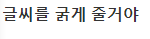

위와 같은 결과가 출력되는 것을 알 수 있다.

## 작동원리


해당 사진처럼 main.js 안에 있는 내용이 Build 과정을 거치며
우리가 사용할 수 있도록 컴파일 되는 것이다.

## 함수관리


함수를 호출할 때 에는 on:click={함수명} 을 주어야 한다.

함수선언은 <script> 태그 안에서 자유롭게 하면 된다.

위와 같은 코드를 준다면 아래와 같이 출련된다.

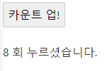

## 반응성 선언

만약 FirstName 이라는 변수와 SecondName 이라는 변수를 조합하여
FullName 을 갖는 변수는 어떻게 사용해야할까??

```javascript
const FirstName = 'Chobby';
const SecondName = 'Kim';
const FullName = FirstName + SecondName;
```

위와같이 입력될 것이지만 만약 이벤트로 FirstName 의 값이 변경된다면 FullName 의 값이 변경될까??

변경되지 않는다. 변경되게 하기 위해서는 변수를 참조하는 변수의 앞에 $: 를 넣어

```javascript
const FirstName = 'Chobby';
const SecondName = 'Kim';
$: FullName = FirstName + SecondName;
```

위와같이 입력해주어야 한다.

## $:

과연 $: 는 어떨때 사용해야할까??

```javascript
<script>$: {alert('hello')}</script>
```

위와 같은경우 컴포넌트가 마운트 될 때 , 스테이트의 값이 어떠한 값이든 변경되는 경우 모두 alert('hello') 가 실행된다.

만약 특정 상태가 변경되는 경우에만 실행하고 싶다면 조건식을 붙일 수 도있다.

```javascript
<script>$: if(value >= 10) {alert('Over 10')}</script>
```

즉 , $: 는 변경되는 상태에 따라 특정 행동을 취해야하는 경우에 사용된다고 볼 수 있다.

## 배열 및 객체 인식

다른 프레임워크들과 같이 상태가 배열 혹은 객체일 경우에


위와 같은 코드를 짜서 버튼을 누른다 하더라도

1 + 2 + 3 + 4 + 5 = 15

해당 화면에서 바뀌지 않는데 그 이유는

배열의 상태변화를 알아차리기 힘들기 때문에 상태가 바뀌더라도 화면에 리랜더링 되지 않는 것이다.

배열의 경우는
스프레드 문법을 이용해

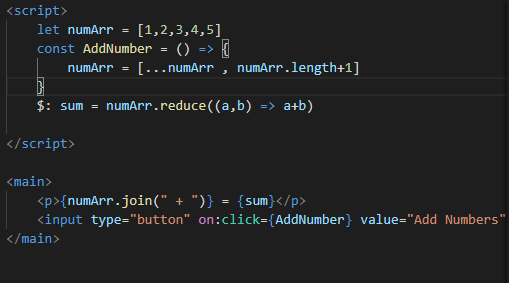

위와 같이 변수 = [...변수 , 새 값]

을 등록하면 변화를 알아차려 리랜더링 한다.


위 이미지는 버튼을 두 번 누른 경우이다.

## Props


부모태그에서 import 한 컴포넌트에 위 사진처럼 프롭스를 주면


자식 컴포넌트에서 export let (프롭스명) 으로 받아 사용이 가능하다.

결과는 다음과 같다.

<h1>Hello There Your Age is 19</h1>

만약 기본값을 주고 싶다면


위 사진에서

```javascript
<script>export let age = (기본값)</script>
```

을 한다면 부모 컴포넌트에서 Props 를 주지않고

<Other /> 로 호출하는경우 기본값으로 반영된다.

만약 Props 가 Object 인 경우


위와 같이 상속해 줄 수 있다

물론 각각의 값만 원하는경우

<Child name={test.name} />

위와같이 전달도 가능하다.


받아오는 경우엔 다른경우와 같이 받아 올 수 있다.

결과화면은 아래와 같다.

<h1>woobin,19,Programmer</h1>

## 조건문


위 사진과 같이 HTML 을 제어할 수 있는 조건문을 작성할 수 있다

```javascript
{#if (조건식)}
    <HTML>
{/if}

```

조건식이 True 를 반환하면 HTML 태그가 보이며 False 를 반환하는 경우 보이지 않는다.

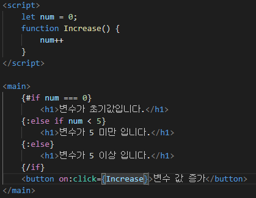

위 사진과 같이 else if 또한 사용이 가능하며 끝에는 항상
{/if} 를 해주어야 오류가 나지 않는다.

## 반복문

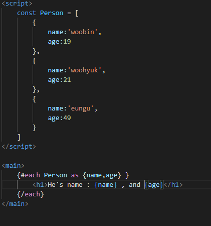

```javascript
{# each (배열) as (값 , 인덱스(생략가능) )}
    <HTML>
{/each}
```

의 형태이며 값 은 구조분해 할당이 가능하고 index 를 인자로 받을 수 있다.

사용의 끝에는 항상 each 를 닫아주어야 한다.

반복을 할 때에는 SvelteJS 뿐만 아니라 다른 프레임워크 에서도 key 값을 주어야 하는데

그 이유는 유동적인 어떤 원소가 생성 , 삭제 , 수정 되었는지 컴퓨터가 알기 위해서 이다.

```javascript
{# each (배열) as (값) (값.id)}
    <HTML>
{/each}
```

위 구조처럼 값.id 가 아니더라도 식별을 위해 사용이 가능한 중복되지 않는 key 를 주어야 한다.

## 비동기 작업

비동기 작업을 위해서

```javascript
{#await (비동기 작업함수)()}
    <p>기다리는 동안 표시할 HTML</p>
{:then testVar}
    <p>로딩이 끝나고 데이터를 표시할 HTML {testVar}</p>
{:catch err}
    <p>{err} 에러처리</p>
{/await}
```

해당 구조를 사용해야한다 다음 사진을 보자

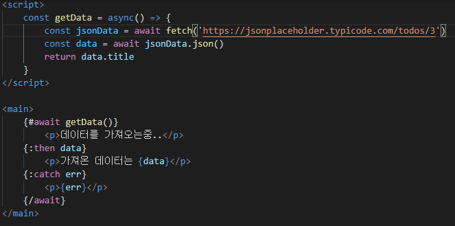

위 사진과 같이 비동기 작업을 할 함수를 SvelteJS 식으로 표현하면 된다.

## 이벤트 처리

모든 이벤트들은 on:(이벤트명) 으로 정의한다

```javascript
<button on:click={event}>Test</button>
<div on:mousemove={event}>Test</div>
<input on:keypress={event} type="text" value="Test" />
```

on 과 event 명을 콜론(:) 으로 구분한다.

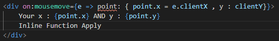

함수를 on:click 안에서 적용하면 어떻게 될까??

인라인 함수를 정의하면 컴파일 과정에서 문제가 된다고 말하지만 이는 SvelteJS 문법상으로는 문제가 없다

개인적인 생각이지만 그래도 불편하니 그냥 함수를 정의하여 사용하는 것이 좋을 것 같다.

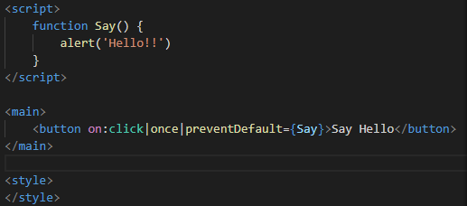

위 사진과 같이 이벤트에는

```javascript
<button on:click|once={함수}>Test</button>
```

해당 형식을 정의하고 있는데 이는 함수를 한 번만 실행하겠다는 것이며

그 다음부턴 눌러도 아무 작동하지 않는다.

그 외에도 preventDefault 를 적용하여 본래 기능을 막아놓았는데

이처럼 여러번 사용할 때 에는 | 연산자를 사용하여 구분한다.

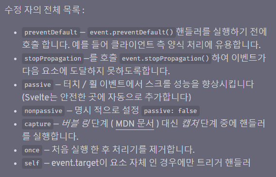

위 사진은 이벤트 수정자를 모아놓은 것이다.

## 디스패치

SvelteJS 의 디스패치는 React 와 비슷한 구조를 갖고있는데

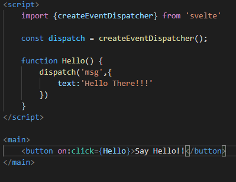

위 사진을 보면

```javascript
import { createEventDispatcher } from 'svelte';

const dispatch = createEventDispatcher();

function Hello() {
	dispatch('msg', {
		text: 'Hello There!!!'
	});
}
```

디스패쳐를 가져와 변수에 할당하여 준 다음

함수에서 디스패치 명 과 필요한 데이터를 담아 쏘아준다.

그렇다면 해당 정보를 어떻게 가져올까??


```javascript
import Inner from './Inner.svelte';
<Inner on:msg={(e) => console.log(e)} />;
```

위와같이 해당 컴포넌트를 import 한 후 HTML 로 재사용 할 때

on:(디스패치 이벤트명) 을 사용하면 받아오기가 가능하며 해당 e 에는

다음과 같은 정보들이 들어있다.

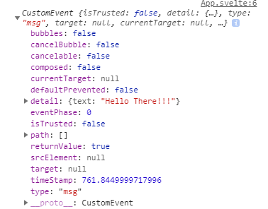

즉 우리가 원하는 데이터는 e.detail.(정의된 데이터 변수명)

해당 예제에서는 e.detail.text 가 되겠다.
